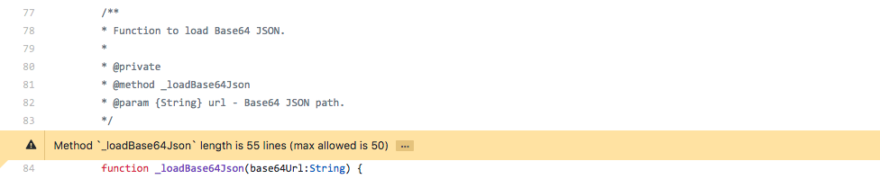

[](http://opensource.org/licenses/MIT)
[](http://lib.haxe.org/p/checkstyle/)
[](https://travis-ci.org/HaxeCheckstyle/haxe-checkstyle)
[](https://github.com/HaxeCheckstyle/haxe-checkstyle/actions)
[](https://codecov.io/github/HaxeCheckstyle/haxe-checkstyle?branch=dev)
<!-- [](https://codeclimate.com/github/HaxeCheckstyle/haxe-checkstyle)
[](https://codeclimate.com/github/HaxeCheckstyle/haxe-checkstyle/issues)
[](https://codeclimate.com/github/HaxeCheckstyle/haxe-checkstyle/issues) -->
[](https://gitter.im/HaxeCheckstyle/haxe-checkstyle)

**Haxe Checkstyle** is a static analysis tool to help developers write Haxe code that adheres to a coding standard.

It automates the process of checking Haxe code to spare developers of this boring (but important) task.

Code conventions improve readability, allowing team members to understand each other's code better.

Ideal for any project that wants to enforce coding conventions.

Static analysis is usually performed as part of a code review.

### Code Climate

Haxe Checkstyle is available on the [Code Climate](https://docs.codeclimate.com/docs/haxe-checkstyle) platform (free for open source projects). It requires a **`.codeclimate.yml`** file and an optional but recommended **`checkstyle.json`** file to be added to the root of your repository - see [here](https://docs.codeclimate.com/docs/haxe-checkstyle) for more details.

When everything is set up, Code Climate automatically runs Haxe Checkstyle for you on each new commit (also on pull requests if configured that way).

The current number of issues can be tracked via a badge:

<!-- [](https://codeclimate.com/github/HaxeCheckstyle/haxe-checkstyle/issues) -->

Immediate results, right in your pull requests.



### Installation

```bash
haxelib install checkstyle
```

### Basic Usage

```bash
haxelib run checkstyle -s src
```

### Automatic detection of your coding style (experimental)

```bash
haxelib run checkstyle -s src --detect detectedCheckstyle.json
```

### VSCode integration

There is a VSCode extension for haxe-checkstyle available in the VSCode marketplace. It is currently built with haxe-checkstyle v2.4.1 and tokentree v1.0.1. You can view the development version here: [vscode-checkstyle](https://github.com/vshaxe/vscode-checkstyle)

### Compiling checkstyle

```bash
git clone https://github.com/HaxeCheckstyle/haxe-checkstyle.git
npm install
lix download
haxe buildAll.hxml # for Neko and NodeJS version + run Unittests and create schema
haxe buildCpp.hxml # for C++ version
```

Compiling with Haxe 3

```bash
git clone https://github.com/HaxeCheckstyle/haxe-checkstyle.git
mv haxe_libraries haxe4_libraries
mv haxe3_libraries haxe_libraries
npm install
lix use haxe 3.4.7
lix download
haxe buildAll.hxml # for Neko and NodeJS version + run Unittests and create schema
haxe buildCpp.hxml # for C++ version
```

### Reference

[More information and reference](http://haxecheckstyle.github.io/docs).

### Issues [](http://waffle.io/HaxeCheckstyle/haxe-checkstyle)

Found any bug? Please create a new [issue](https://github.com/HaxeCheckstyle/haxe-checkstyle/issues/new).

### Coverage


### Licensing Information

This content is released under the [MIT](http://opensource.org/licenses/MIT) license.

This project was derived from [haxelint](https://github.com/mcheshkov/haxelint)
created by [@mcheshkov](https://github.com/mcheshkov).

### Contributor Code of Conduct

[Code of Conduct](https://github.com/CoralineAda/contributor_covenant) is adapted from
[Contributor Covenant, version 1.4](http://contributor-covenant.org/version/1/4)
